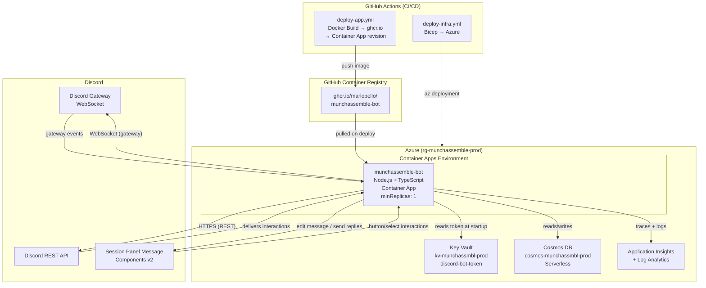
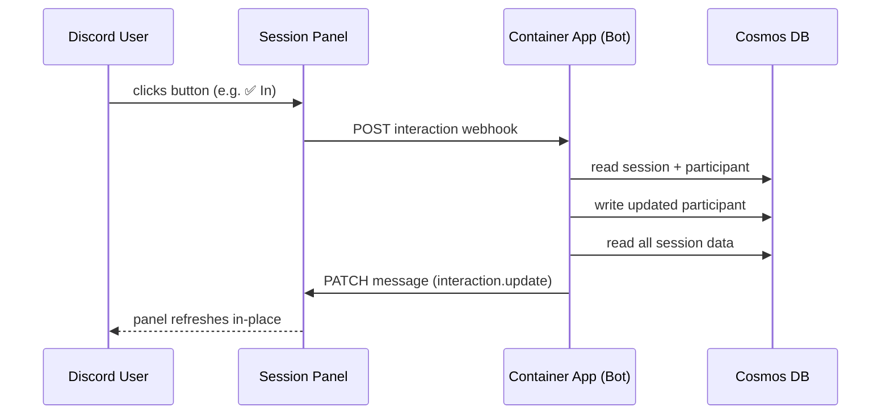
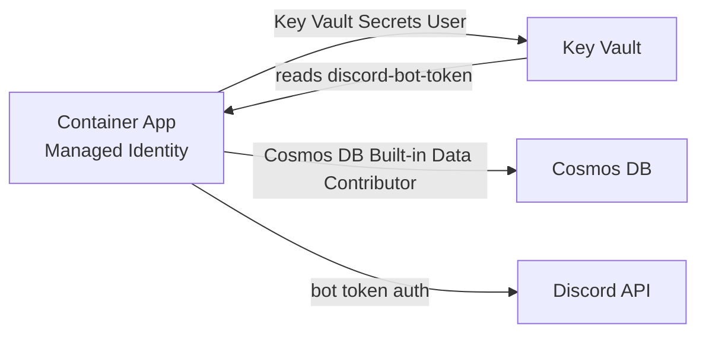
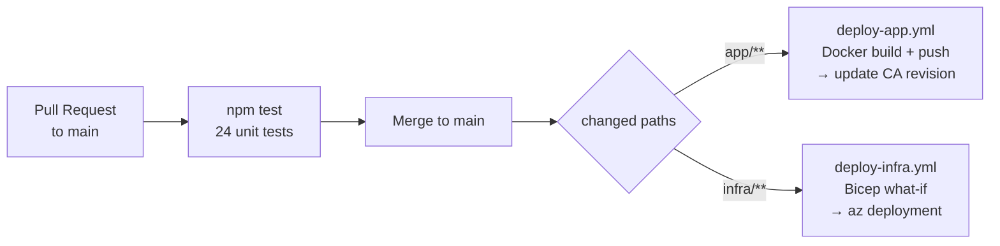

# System Architecture

> High-level overview of the Munch Assemble production deployment on Azure.

## Component Diagram



## Runtime Data Flow



## Infrastructure Components

| Component | SKU / Config | Purpose |
|---|---|---|
| Container App | Consumption, minReplicas=1, always-on | Hosts the bot process |
| Container Apps Env | Consumption | Networking envelope |
| Cosmos DB | Serverless, 3 containers | Persistent session/participant/restaurant/carpool data |
| Key Vault | Standard | Stores `discord-bot-token` secret |
| App Insights | Pay-as-you-go | Traces, logs, live metrics |
| Log Analytics Workspace | Pay-as-you-go | Backend for App Insights |
| Container Registry | **None** — uses ghcr.io (public) | Image hosting |

## Security Model



- All Azure service access uses **Managed Identity** — no stored credentials or connection strings.
- Bot token is retrieved from Key Vault at startup via `DefaultAzureCredential`.
- No inbound network exposure: bot connects **outbound** to Discord's gateway (WebSocket) and REST API.

## Deployment Pipeline



## Source Code Layout

```
munchassemble/
├── app/
│   ├── src/
│   │   ├── commands/          # Slash command definitions (/munchassemble)
│   │   ├── db/
│   │   │   ├── cosmosClient.ts
│   │   │   └── repositories/  # Data access layer (participantRepo, carpoolRepo, …)
│   │   ├── interactions/      # Discord interaction handlers (attendanceHandler, carpoolHandler, …)
│   │   ├── services/          # Business logic (carpoolService, restaurantService, …)
│   │   ├── types/             # Shared TypeScript interfaces + enums
│   │   ├── ui/
│   │   │   └── panelBuilder.ts  # Components v2 panel construction
│   │   └── utils/
│   │       ├── panelRefresh.ts  # Shared panel update utility
│   │       ├── permissions.ts   # Creator/admin checks
│   │       ├── scheduler.ts     # T-15/T-5 reminder cron jobs
│   │       └── stateRules.ts    # Attendance/transport state machine rules
│   └── tests/
│       └── unit/              # Jest unit tests (24 tests)
├── infra/
│   ├── main.bicep             # Top-level orchestration
│   ├── modules/               # Reusable Bicep modules (cosmos, keyvault, containerapp, …)
│   └── env/
│       └── prod.bicepparam    # Production environment parameters
└── docs/
    ├── brd.md                 # Business requirements
    ├── nfr.md                 # Non-functional requirements
    ├── erd.md                 # Entity relationship diagram ← this file's sibling
    ├── state-machine.md       # Attendance/transport state machine
    ├── architecture.md        # This file
    ├── user-journeys.md       # Step-by-step user flows
    ├── adr/                   # Architecture Decision Records
    └── runbooks/              # Operational runbooks
```
