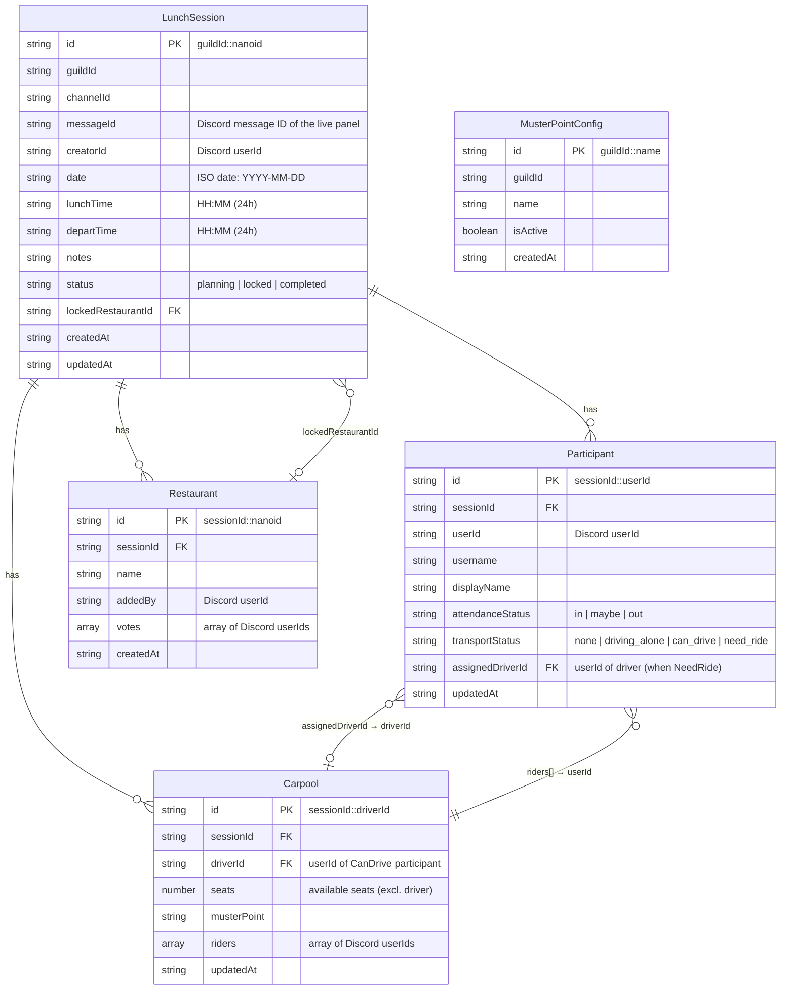

# Entity Relationship Diagram

> Data model for Munch Assemble. All data persists in Azure Cosmos DB (NoSQL).
> Relationships are represented by stored IDs — there are no foreign key constraints at the DB level.

## Container → Partition Key mapping

| Cosmos Container | Partition Key | Notes |
|---|---|---|
| `sessions` | `/guildId` | One active session per guild at a time. **Retained indefinitely** (see Retention below). |
| `participants` | `/sessionId` | All RSVPs + transport for a session |
| `restaurants` | `/sessionId` | Voting options + vote tallies |
| `carpools` | `/sessionId` | One document per driver |
| `restaurantoptions` | `/guildId` | Guild-configurable restaurant pick-list (users pick from this only) |
| `musterpoints` | `/guildId` | Guild-configurable pickup locations |
| `noping` | `/guildId` | Guild members excluded from the 🔔 Ping Unanswered reminder |
| `favorites` | `/guildId` | Present in production; **not yet covered by current source / a BRD requirement** — treat as experimental until a feature owns it. |

## Retention

All containers retain data **indefinitely**. Although `LunchSession` carries an optional
`_ttl` field and an earlier design note described completed sessions expiring after 30
days, **no code path sets `_ttl`** and the misleading container `defaultTtl` config has
been removed — so completed sessions persist. This durable history is what the Phase 4
analytics web app (ADR-0006, BRD §3 BR-071–075) reads.

## Key invariants

- `Carpool.id = sessionId::driverId` — only one carpool record per driver per session.
- `Participant.id = sessionId::userId` — only one participant record per user per session.
- `Carpool.riders[]` and `Participant.assignedDriverId` are kept in sync by the carpool service.
- `Restaurant.votes[]` holds at most one entry per userId (enforced by `castVote`).
- A participant's `transportStatus` is only non-`none` when `attendanceStatus === in` (or `maybe` for `driving_alone`/`need_ride`).
