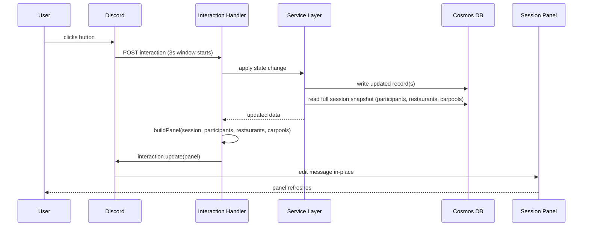
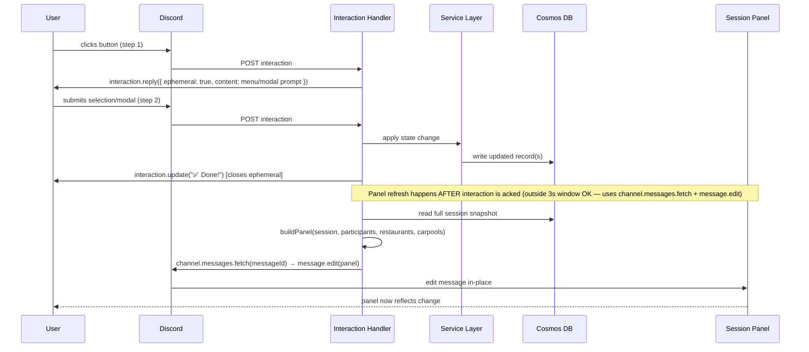
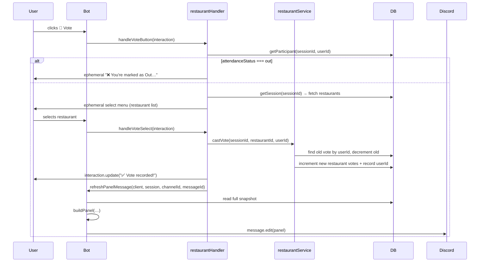
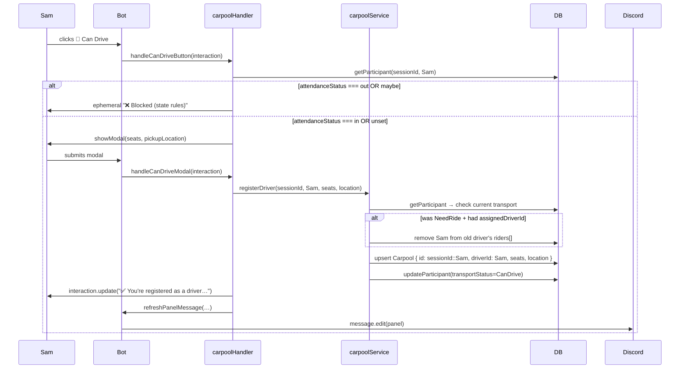
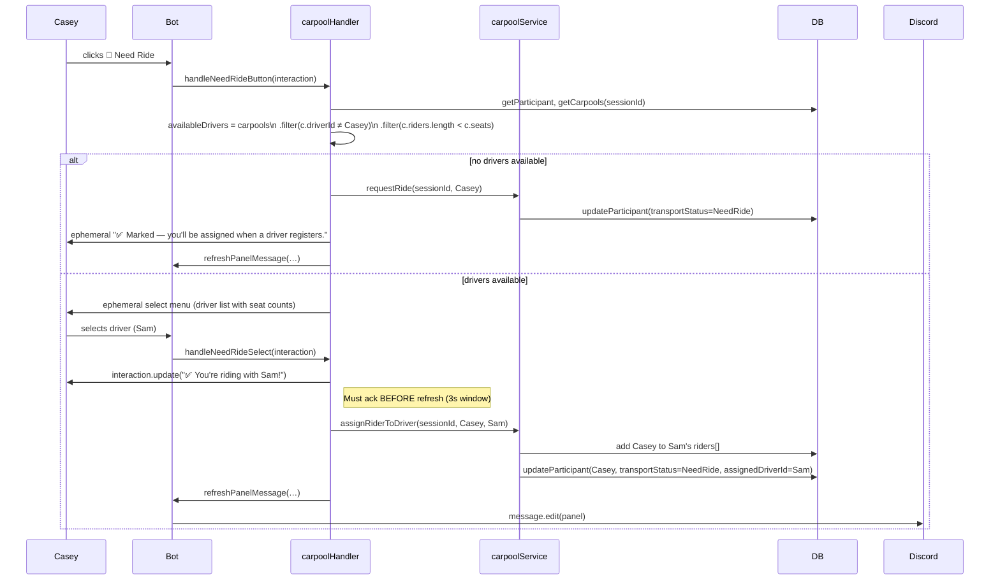
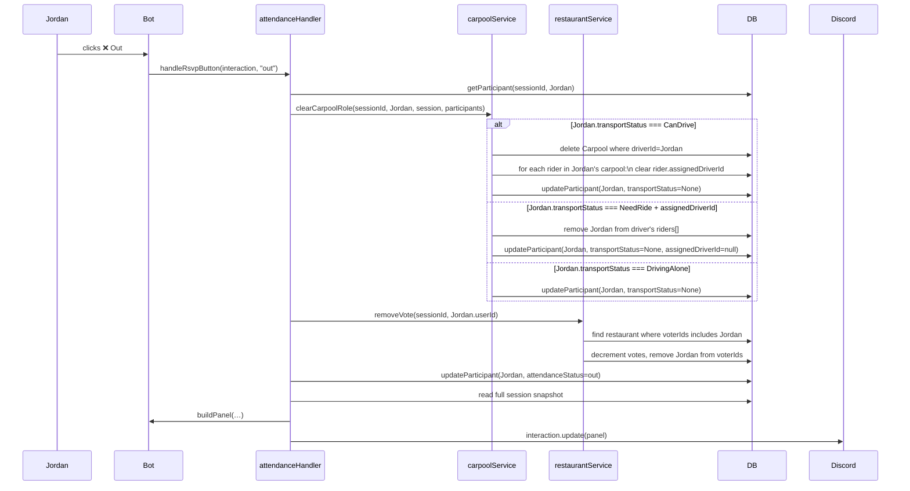

# Sequence Diagrams — Key Interaction Flows

> Technical sequence diagrams for the primary Discord bot interaction patterns.
> Focus is on the interaction/service/DB layers and the panel refresh lifecycle.

---

## Pattern A — Direct Panel Update (No Ephemeral)

Used by: Attendance (In/Maybe/Out), Driving Alone, Lock/Finalize, Ping Unanswered.

> **Critical:** `interaction.update()` must be called within 3 seconds of the interaction arriving. All DB reads/writes happen before this call.

---

## Pattern B — Ephemeral → Panel Refresh

Used by: Restaurant Vote, Add Restaurant (new name), Can Drive (modal), Need Ride select.

> **Why `message.edit` not `interaction.update` for refresh?**
> By the time the second interaction is acked, the first interaction's 3-second window is long gone.
> `channel.messages.fetch()` + `message.edit()` works at any time after the interaction chain completes.

---

## Restaurant Vote Flow (Detail)

---

## Can Drive / Carpool Registration Flow (Detail)

---

## Need Ride → Assign Flow (Detail)

---

## Attendance Change Cascade — Out (Detail)

