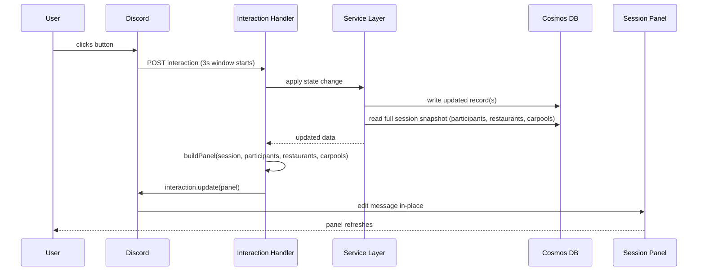
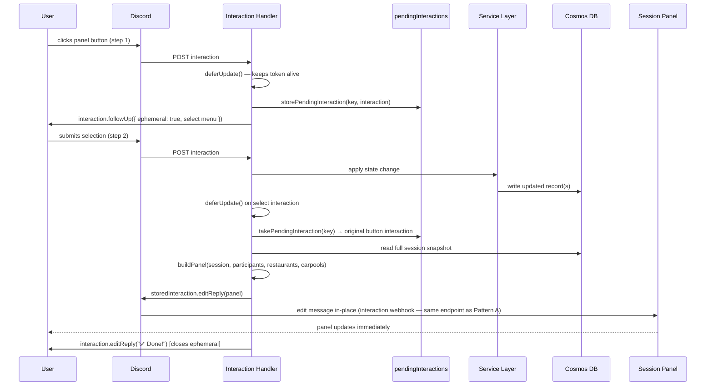
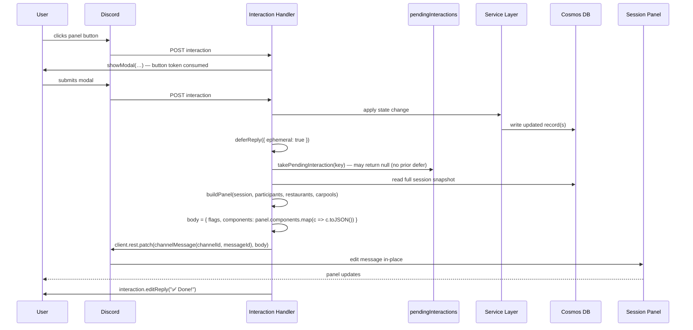
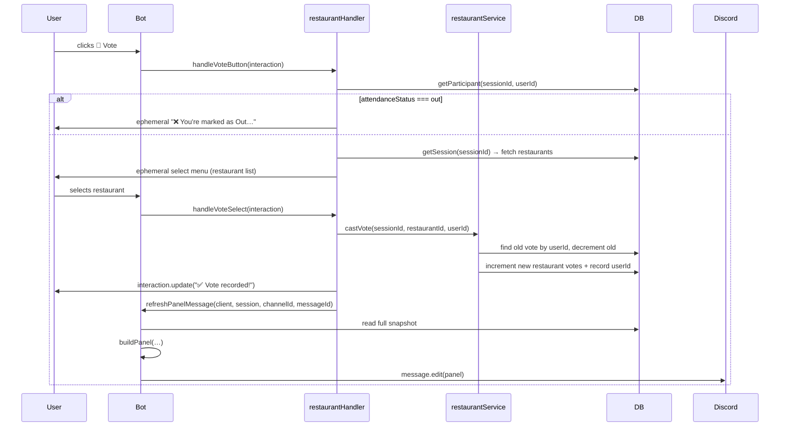
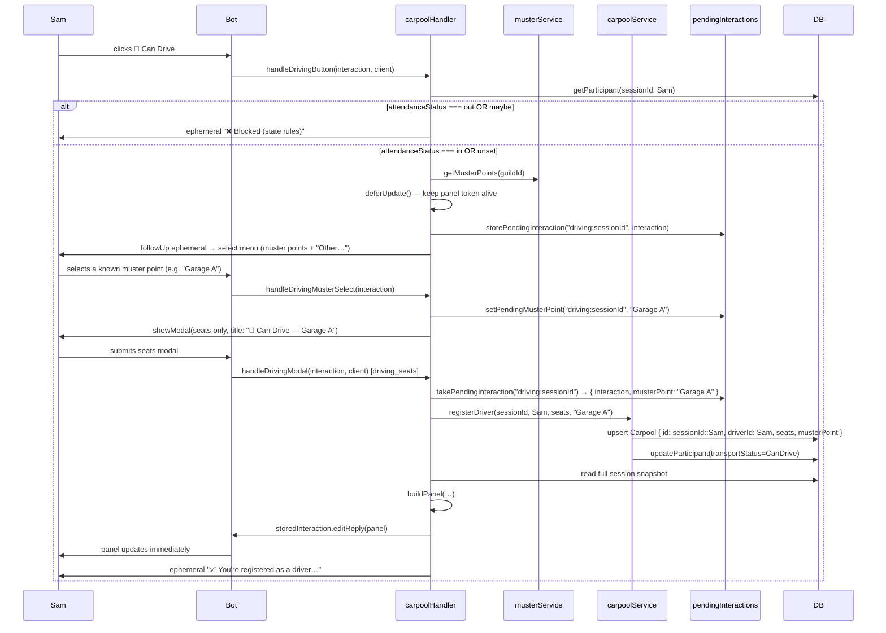
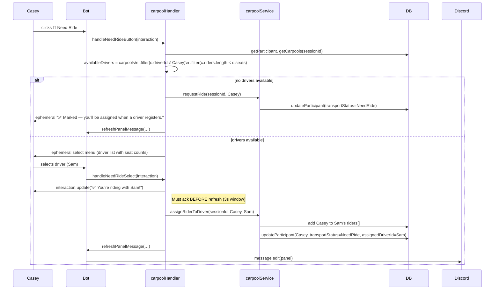
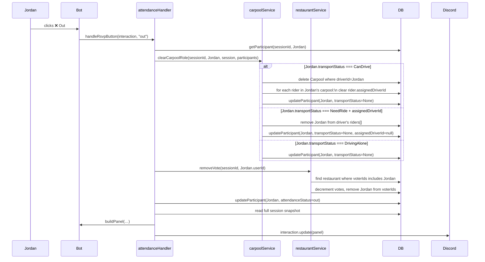

# Sequence Diagrams — Key Interaction Flows

> Technical sequence diagrams for the primary Discord bot interaction patterns.
> Focus is on the interaction/service/DB layers and the panel refresh lifecycle.

---

## Pattern A — Direct Panel Update (No Ephemeral)

Used by: Attendance (In/Maybe/Out), Driving Alone, Lock/Finalize, Ping Unanswered.

> **Critical:** `interaction.update()` must be called within 3 seconds of the interaction arriving. All DB reads/writes happen before this call.

---

## Pattern B — Ephemeral → Panel Refresh (via stored interaction)

Used by: Add Restaurant (from favorites select), Can Drive (from muster point select).

> **Why this works:** `deferUpdate()` on the original panel button keeps the interaction webhook token alive for 15 minutes. Subsequent `editReply()` calls on that stored interaction use the exact same webhook endpoint as Pattern A — the proven path for Components V2 panel updates.

---

## Pattern C — Modal → Panel Refresh (REST fallback)

Used by: Add Restaurant (direct modal — no favorites), Can Drive "Other…" path, Edit Time, Carpool Switch, Auto-Assign.

> **Why `.toJSON()` is required:** `discord.js message.edit()` expects `ActionRowBuilder[]` in the components array and silently drops top-level `ContainerBuilder` instances (Components V2). Explicitly serialising with `.toJSON()` before the REST call produces the correct API payload.

---

## Restaurant Vote Flow (Detail)

---

## Can Drive / Carpool Registration Flow (Detail)

**"Other…" path (free-text muster):** Sam picks "✏️ Type a custom location…" → full modal (seats + muster) → on submit, stored interaction is retrieved and panel updated via `editReply`; falls back to `refreshPanelMessage` if the token expired.

---

## Need Ride → Assign Flow (Detail)

---

## Attendance Change Cascade — Out (Detail)

