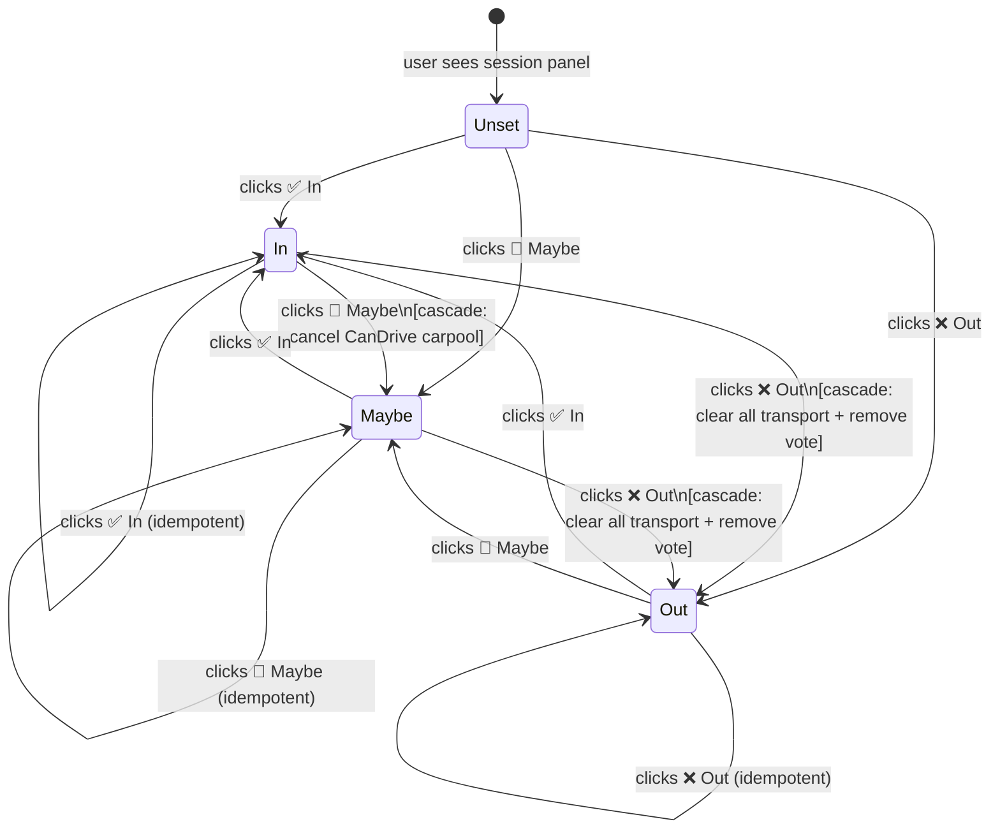
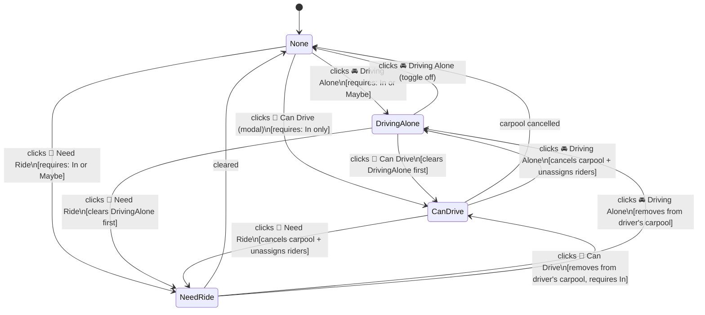

# Attendance & Transport State Machine

> Authoritative reference for all valid state transitions.
> Implemented in `app/src/utils/stateRules.ts`.

## State Definitions

### Attendance States

| State | Meaning |
|---|---|
| `in` | User is confirmed attending |
| `maybe` | User is uncertain — might come |
| `out` | User is not attending |
| *(unset)* | User has never interacted with the session |

### Transport States

| State | Meaning | Valid When |
|---|---|---|
| `none` | No transport declared | Any attendance |
| `driving_alone` | Driving to lunch independently | `in` or `maybe` |
| `can_drive` | Hosting a carpool (seats available) | `in` only |
| `need_ride` | Requesting a seat in a carpool | `in` or `maybe` |

---

## Attendance × Transport Validity Matrix

| Attendance | Vote | Driving Alone | Can Drive (host) | Need Ride |
|---|---|---|---|---|
| **In** | ✅ | ✅ | ✅ | ✅ |
| **Maybe** | ✅ | ✅ *(stays Maybe)* | ❌ Blocked | ✅ *(stays Maybe)* |
| **Out** | ❌ Blocked | ❌ Blocked | ❌ Blocked | ❌ Blocked |
| **Unset** | ✅ | ✅ → auto-promote to In | ✅ → auto-promote to In | ✅ → auto-promote to In |

---

## Attendance Transition Diagram

---

## Transport Transition Diagram

---

## Cascade Rules on Attendance Change

### → Out
All of the following happen atomically before the attendance record is updated:

1. **Cancel hosted carpool** (if `CanDrive`): unassigns all riders back to `NeedRide` (unassigned), deletes carpool record.
2. **Remove from joined carpool** (if `NeedRide` with `assignedDriverId`): removes userId from driver's `riders[]` array, clears `assignedDriverId`.
3. **Clear DrivingAlone** transport status.
4. **Remove restaurant vote** from any restaurant the user voted for.

### → Maybe
Only CanDrive is incompatible with Maybe:

1. **Cancel hosted carpool** (if `CanDrive`): unassigns all riders, deletes carpool record.
2. DrivingAlone and NeedRide **are preserved** — no changes.
3. Restaurant vote **is preserved** — no changes.

### → In
No cascade. User starts fresh and may re-vote / re-select transport as desired.

---

## Error Messages

| Scenario | Message shown to user |
|---|---|
| Out user clicks Vote | ❌ You're marked as **Out** and cannot vote on a restaurant. |
| Out user clicks any transport | ❌ You're marked as **Out** — set your attendance to **In** or **Maybe** first. |
| Maybe user clicks Can Drive | ❌ You need to confirm you're **In** before hosting a carpool. |
