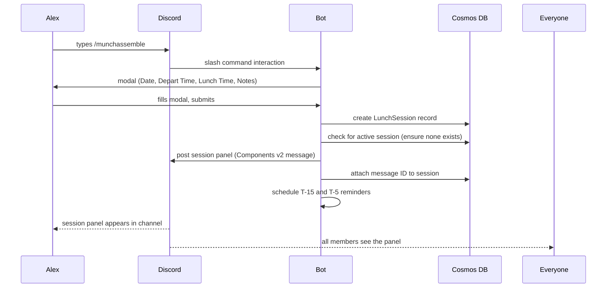
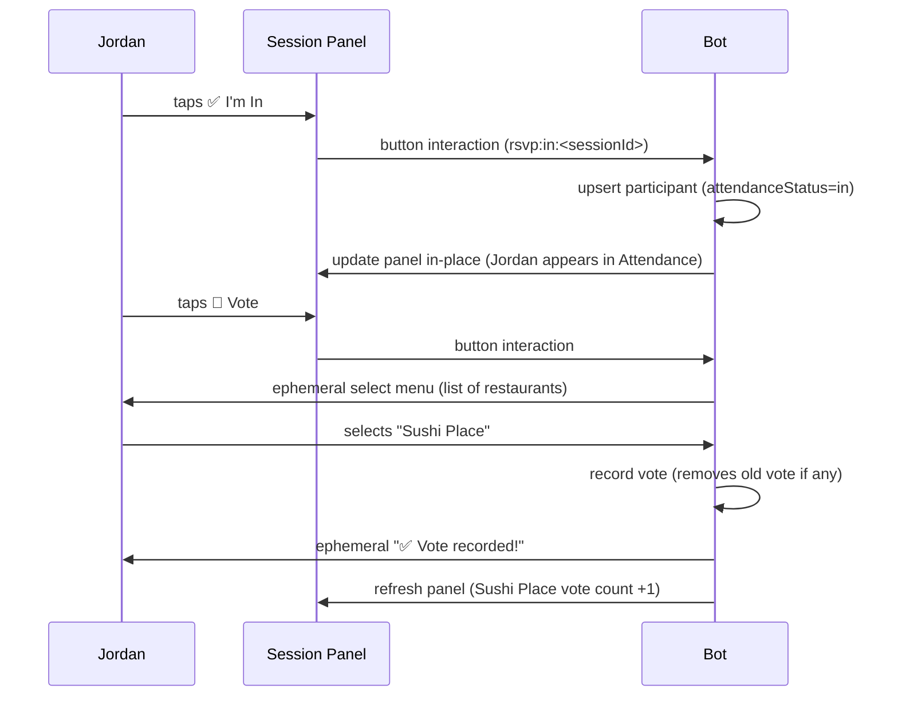
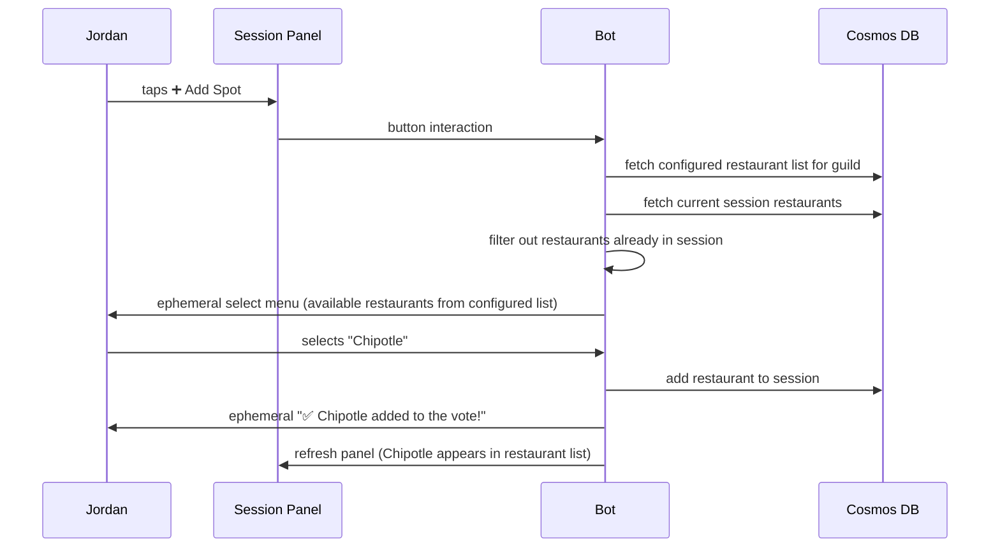
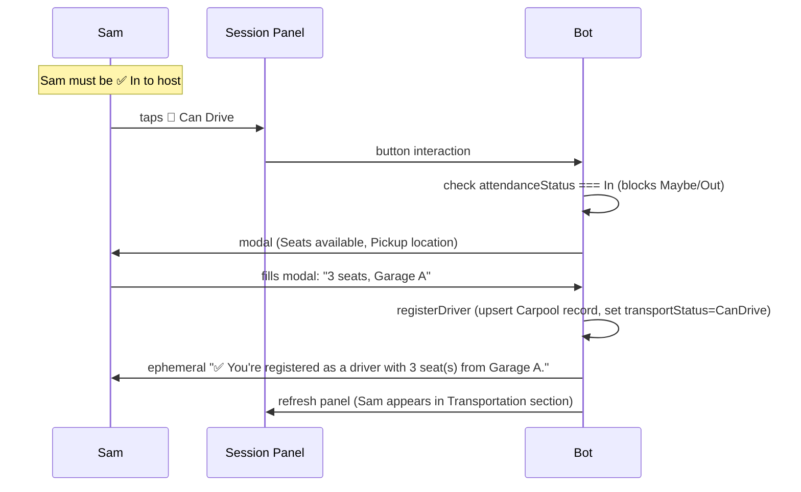
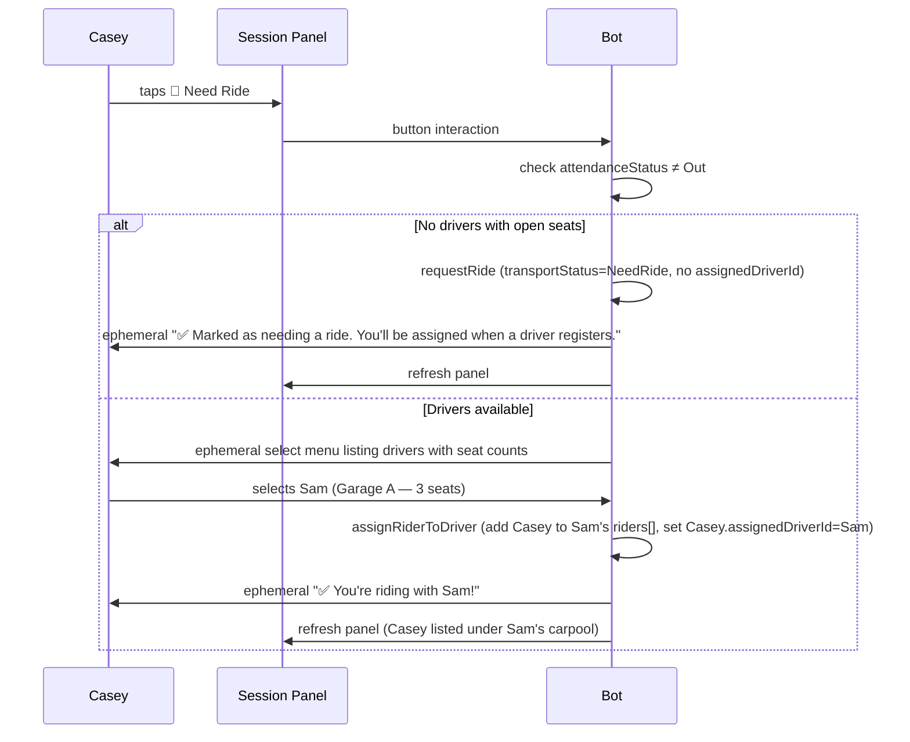
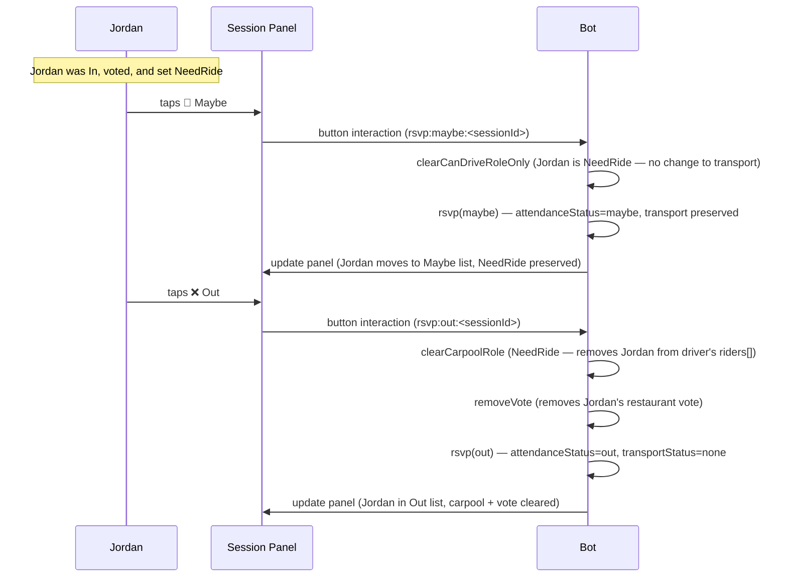
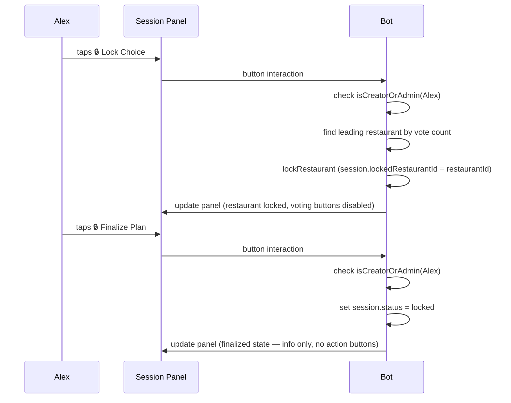
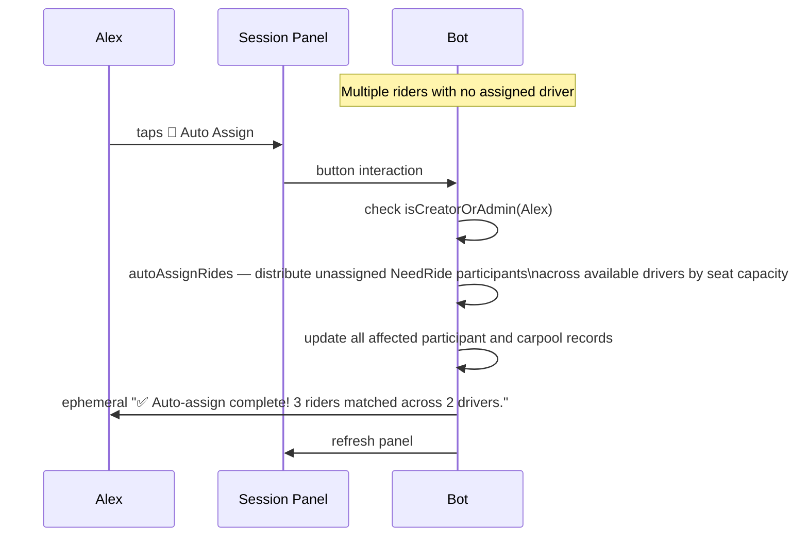
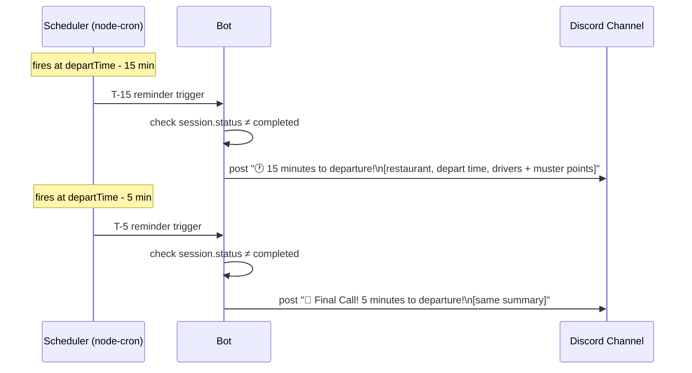
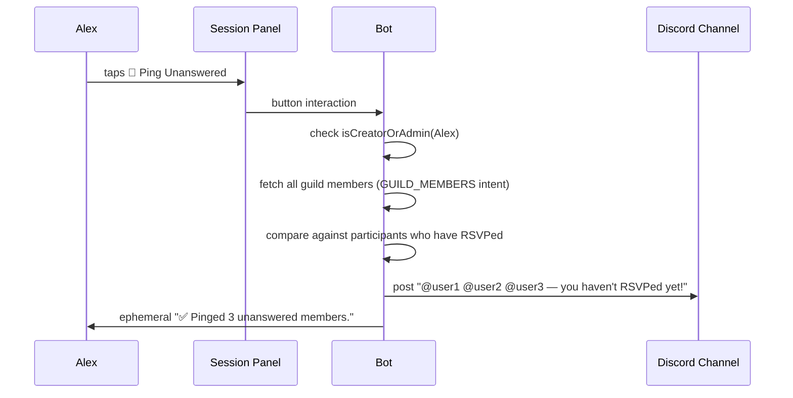

# User Journey Stories

> Detailed step-by-step flows for the key user personas and scenarios.
> All journeys assume Discord mobile unless otherwise noted.

---

## Personas

| Persona | Role | Permissions |
|---|---|---|
| **Alex** | Session creator | Full admin rights for the session |
| **Jordan** | Regular attendee | Can RSVP, vote, choose transport |
| **Sam** | Driver | Same as Jordan + hosting a carpool |
| **Casey** | Rider | Same as Jordan + joining a carpool |
| **Riley** | Non-attendee | Clicks Out |

---

## Journey 1 — Creating a Session (Alex)

**Key rules:**
- Only one active session per Discord server at a time (BR-001).
- Defaults: Lunch 11:15 AM, Depart 11:00 AM.

---

## Journey 2 — Attending & Voting (Jordan, mobile)

**Key rules:**
- Out users cannot vote — they receive a blocked message (BR state machine).
- Each user has exactly one vote; re-voting changes their vote (BR-021).

---

## Journey 3 — Adding a Restaurant (Jordan)

**Key rules:**
- Only restaurants on the guild's configured list can be added (BR-024).
- The select menu only shows restaurants not already in the current session.
- Admins manage the list with `/munchassemble-config restaurant add/remove/list` (BR-024).

---

## Journey 4 — Hosting a Carpool (Sam)

**Key rules:**
- Maybe users cannot host a carpool — they receive a blocked message.
- If Sam was previously a NeedRide rider, they are automatically removed from the old driver's carpool.

---

## Journey 5 — Joining a Carpool (Casey)

**Key rules:**
- Casey cannot select Sam's carpool if Sam is Casey (self-join guard).
- Sam's carpool capacity is enforced — no over-booking.
- If Casey was previously CanDrive, their carpool is cancelled and riders re-queued before assigning.

---

## Journey 6 — Changing Your Mind (Jordan: In → Maybe → Out)

---

## Journey 7 — Finalizing the Plan (Alex)

---

## Journey 8 — Auto-Assign Rides (Alex)

---

## Journey 9 — T-15 / T-5 Reminders (Automated)

**Key rules:**
- Reminders are cancelled if the session is finalized or expired before they fire (BR-062).
- Scheduler runs in-process inside the Container App (always-on, minReplicas=1).

---

## Journey 10 — Ping Unanswered (Alex)

